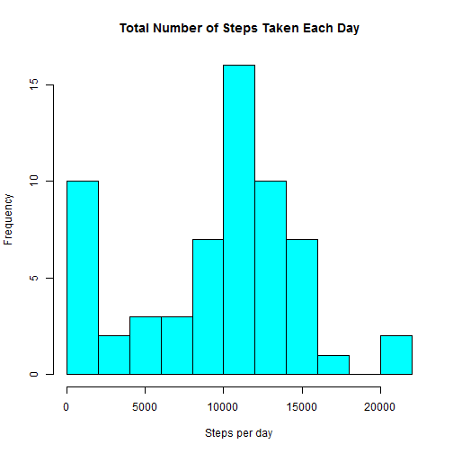
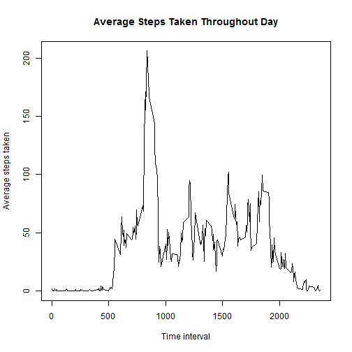
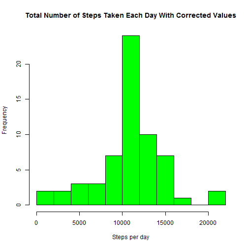
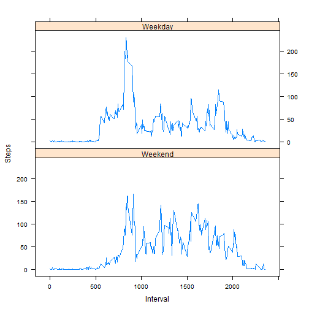

# Peer Assessment 1  

Loading and preprocessing the data
---

```r
data <- read.csv("~/R/Data Science/Reproducible_Research/Assignment_1/activity.csv")
head(data)
```

```
##   steps       date interval
## 1    NA 2012-10-01        0
## 2    NA 2012-10-01        5
## 3    NA 2012-10-01       10
## 4    NA 2012-10-01       15
## 5    NA 2012-10-01       20
## 6    NA 2012-10-01       25
```


```r
data$date <- as.Date(data$date, format = "%Y-%m-%d")
data.class(data$date)
```

```
## [1] "Date"
```

Steps taken per day
---
First we calculate the steps taken on each day.

```r
daily_steps <- function(day){
        date.key <- data$date == day
        sub.data <- data[date.key,]
        sum(sub.data[,1], na.rm = TRUE)
}
days <- unique(data$date)
steps <- sapply(days, daily_steps)
steps_per_day <- data.frame("date" = days, "steps" = steps)
head(steps_per_day)
```

```
##         date steps
## 1 2012-10-01     0
## 2 2012-10-02   126
## 3 2012-10-03 11352
## 4 2012-10-04 12116
## 5 2012-10-05 13294
## 6 2012-10-06 15420
```
Then we plot the results.

```r
hist(steps, breaks = 10, col = "cyan", xlab = "Steps per day", main = "Total Number of Steps Taken Each Day")
```

 

We can also use the results to find the mean and median for the total number of steps taken on each day.

```r
step.med <- median(steps)
step.mean <- mean(steps)
c("Median" = step.med, "Mean" = step.mean)
```

```
##   Median     Mean 
## 10395.00  9354.23
```
So we have that the median steps taken per day and the average steps taken per day.

Average daily activity pattern
---
First, let's calculate the average steps taken for each 5 minute interval.

```r
int_steps <- function(interval){
        int.key <- data$interval == interval
        sub.data <- data[int.key,]
        mean(sub.data[,1], na.rm = TRUE)
}
intervals <- unique(data$interval)
average.steps <- sapply(intervals, int_steps)
steps_per_int <- data.frame("interval" = intervals, "ave.steps" = average.steps)
head(steps_per_int)
```

```
##   interval ave.steps
## 1        0 1.7169811
## 2        5 0.3396226
## 3       10 0.1320755
## 4       15 0.1509434
## 5       20 0.0754717
## 6       25 2.0943396
```
So now we can plot our results.

```r
plot(intervals, average.steps, type = "l", xlab = "Time interval", ylab = "Average steps taken", main = "Average Steps Taken Throughout Day" )
```

 

We can now use the data to find which interval on average has the most steps in a day.

```r
astep.max <- max(average.steps)
max.key <- average.steps == astep.max
steps_per_int[max.key,]
```

```
##     interval ave.steps
## 104      835  206.1698
```
Which gives us that the 835th interval contains the maximum steps.

Inputing missing values
---
Let's find the total number of missing values in the data set.

```r
missing.key <- is.na(data[,1])
nrow(data[missing.key,])
```

```
## [1] 2304
```
So we see how many missing values are in our set. For the missing values I will compute a value to fill its place with the average steps for that interval. I will approach this by first breaking the data into complete and incomplete segments. Then, I will  approximate the missing values using the above formula. Finally, I will merge the two sets back together. 

```r
complete.data <- data[!missing.key,]
incomplete.data <- data[missing.key,]
for(i in 1:nrow(incomplete.data)){
        temp.interval <- incomplete.data[i,3]
        temp.int.key <- steps_per_int[,1] == temp.interval
        temp.int.steps <- steps_per_int[temp.int.key,][,2]
        incomplete.data[i,1] <- temp.int.steps
}
ref.data <- rbind(complete.data, incomplete.data)
head(ref.data)
```

```
##     steps       date interval
## 289     0 2012-10-02        0
## 290     0 2012-10-02        5
## 291     0 2012-10-02       10
## 292     0 2012-10-02       15
## 293     0 2012-10-02       20
## 294     0 2012-10-02       25
```
Now we must calculate the new total steps per day, and then we can plot a new graph using the data with substituted missing values.

```r
ref.daily_steps <- function(day){
        ref.date.key <- ref.data$date == day
        ref.sub.data <- ref.data[ref.date.key,]
        sum(ref.sub.data[,1], na.rm = TRUE)
}
ref.steps <- sapply(days, ref.daily_steps)
hist(ref.steps, breaks = 10, col = "green", xlab = "Steps per day", main = "Total Number of Steps Taken Each Day With Corrected Values")
```

 

And for our new median and mean we have:

```r
ref.step.med <- median(ref.steps)
ref.step.mean <- mean(ref.steps)
c("Median" = ref.step.med, "Mean" = ref.step.mean)
```

```
##   Median     Mean 
## 10766.19 10766.19
```
As you can see, both the mean and median for the new data are larger then those of the original data. By assuming the missing values corresponded to the mean for the given interval we skewed the results since those values were ommited in the original process. 

Activity patterns between weekdays and weekends
---

```r
week.key_1 <- weekdays(ref.data[,2], abbreviate = TRUE) == "Sat"
weekday_data <- ref.data[!week.key_1,]
weekend_data <- ref.data[week.key_1,]
week.key_2 <- weekdays(weekday_data[,2], abbreviate = TRUE) == "Sun"
weekend_data <- rbind(weekend_data, weekday_data[week.key_2,])
weekday_data <- weekday_data[!week.key_2,]
weekday_data[,2] <- weekdays(weekday_data[,2])
weekend_data[,2] <- weekdays(weekend_data[,2])
head(weekday_data)
```

```
##     steps    date interval
## 289     0 Tuesday        0
## 290     0 Tuesday        5
## 291     0 Tuesday       10
## 292     0 Tuesday       15
## 293     0 Tuesday       20
## 294     0 Tuesday       25
```

```r
head(weekend_data)
```

```
##      steps     date interval
## 1441     0 Saturday        0
## 1442     0 Saturday        5
## 1443     0 Saturday       10
## 1444     0 Saturday       15
## 1445     0 Saturday       20
## 1446     0 Saturday       25
```

```r
int_steps_end <- function(interval){
        int.key <- weekend_data$interval == interval
        sub.data <- weekend_data[int.key,]
        mean(sub.data[,1], na.rm = TRUE)
}
weekend_steps <- sapply(intervals, int_steps_end)
```

```r
int_steps_day <- function(interval){
        int.key <- weekday_data$interval == interval
        sub.data <- weekday_data[int.key,]
        mean(sub.data[,1], na.rm = TRUE)
}
weekday_steps <- sapply(intervals, int_steps_day)
```

```r
par(mfrow = c(2,1))
plot(intervals, weekend_steps, type = "l")
plot(intervals, weekday_steps, type = "l")
```

 
